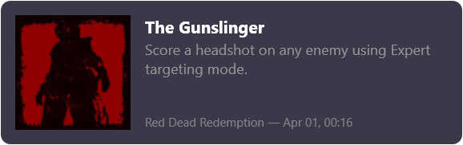
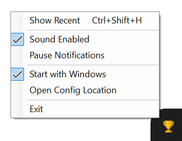

# Achievement Overlay

[](https://github.com/AnotherSava/achievement-overlay/actions/workflows/build.yml)

A Windows background app that displays Steam-like achievement popup notifications for games running in [Goldberg Steam Emulator](https://github.com/Detanup01/gbe_fork).



## How it works

The Steam emulator stores achievement data in JSON files and updates them as soon as the next one gets unlocked. Achievement Overlay monitors these files and notifies the user with Steam-style pop-up notifications.

## Features

- **Steam-style notifications** — achievement icon, name, and description slide in at the bottom-right of the game window
- **Non-invasive** — works even with particularly sensitive games like Red Dead Redemption
- **Recent achievements** — press Ctrl+Shift+H (shortcut is configurable) to review recent achievements. Also the easiest way to test that the overlay is working. Press again or Esc to dismiss
- **Automatic game detection** — scans configured directories for games with achievement metadata
- **Multi-monitor support** — notifications appear on the monitor with the foreground window, with correct DPI scaling across mixed-DPI setups
- **Unlock sound** — plays a default or user-defined sound on achievement unlock
- **Configurable** via `config.json` (ships with the app)
- **Start with Windows** option in the tray menu

## Installation

Download the latest release from [GitHub Releases](https://github.com/AnotherSava/achievement-overlay/releases). Choose one of the two options:

- **Self-contained** — single exe, just unzip and run (no dependencies, larger size)
- **Framework-dependent** — smaller download, requires [.NET Desktop Runtime 10](https://dotnet.microsoft.com/download/dotnet/10.0)

After extracting, check `gamesPaths` in [`config.json`](#configuration) — it should point to the directories where your games are installed.

You can also build the most recent (and potentially less stable) version [from source](#building-from-source).

## System tray menu

Right-click the tray icon for these options:

- **Show Recent** *(keyboard shortcut)* — display recent achievements. Press again or Esc to dismiss.
- **Sound Enabled** — toggle notification sound
- **Pause Notifications** — suppress popups while checked (resets on restart)
- **Start with Windows** — add/remove from Windows startup via registry
- **Open Config Location** — opens Explorer with `config.json` selected
- **Exit** — stops watching and exits the app



## Configuration

A `config.json` file ships next to the executable with sensible defaults. Edit it before or after the first run. `soundEnabled`, `soundPath`, and `displayDuration` are picked up automatically on change. Changing `gseSavesPaths` or `gamesPaths` requires a restart.

### Settings

| Setting | Description | Default |
|---|---|---|
| `gamesPaths` | Semicolon-separated list of directories to scan for games with `steam_appid.txt`. | `C:\Games` |
| `gseSavesPaths` | Semicolon-separated list of GSE Saves directories. Supports `%appdata%` and other env vars. | `%appdata%\GSE Saves` |
| `language` | Preferred language for achievement display text. Falls back to english. | `english` |
| `soundEnabled` | Play a sound on achievement unlock. | `true` |
| `soundPath` | Custom `.wav` sound file path. Empty uses the built-in default. | (empty) |
| `displayDuration` | How long the unlock notification stays on screen, in seconds. | `7` |
| `recentAchievementsShortcut` | Global keyboard shortcut to show/hide recent achievements. | `Ctrl+Shift+H` |
| `recentAchievementsCount` | Number of recent achievements to display. | `5` |

### Example config

```json
{
  "gamesPaths": "C:\\Games;D:\\Games",
  "gseSavesPaths": "%appdata%\\GSE Saves",
  "language": "english",
  "soundEnabled": true,
  "soundPath": "",
  "displayDuration": 7,
  "recentAchievementsShortcut": "Ctrl+Shift+H",
  "recentAchievementsCount": 5
}
```

## Troubleshooting

The app writes a log file (`overlay.log`) next to the config file (use the tray context menu to find it). Check it for diagnostic information. Look for `[WARN]` and `[ERROR]` entries.

### App won't start

The app shows an error dialog on startup if the config is missing, has invalid JSON, or has invalid settings. Click "Details" to see the full log. Common causes:

- **Config file not found** — make sure `config.json` is in the same folder as the executable. Re-extract it from the release archive if needed.
- **Invalid JSON** — fix the syntax in `config.json`. Use the [example config](#example-config) above as a reference.
- **Invalid settings** — required fields like `gseSavesPaths`, `gamesPaths`, `displayDuration`, or `recentAchievementsCount` may be missing or have invalid values.
- **GSE Saves directory does not exist** — check that `gseSavesPaths` points to valid directories (default: `%appdata%\GSE Saves`). Non-existent paths are logged as warnings and skipped; the app exits only if none are valid.
- **No games with achievement metadata found** — check that `gamesPaths` points to directories containing games with `steam_appid.txt` and `steam_settings/achievements.json`. Generate metadata using [generate_emu_config](https://github.com/Detanup01/gbe_fork_tools/tree/main/generate_emu_config_old) if needed.

### Game is not found

If the log shows `[WARN] Game path does not exist`, check that `gamesPaths` in `config.json` points to valid directories.

If the game doesn't appear in the log at all, make sure its directory is under one of the paths listed in `gamesPaths` and that it has a `steam_appid.txt` file.

If the log shows `[WARN] Skipped: appid=... (no 'achievements.json')`, the game is detected but has no achievement metadata. Generate it using [generate_emu_config](https://github.com/Detanup01/gbe_fork_tools/tree/main/generate_emu_config_old) and restart the app.

If no games are found at all, the app exits with an error dialog — check `gamesPaths` in config.

### Notification shows default icon instead of achievement icon

The icon path in the game's `steam_settings/achievements.json` doesn't match an actual file. Check that the `icon` field (e.g. `"img/abc123.jpg"`) points to an existing file relative to the `steam_settings/` directory.

### Wrong language

The log shows `[WARN] Language '...' not available, falling back to english`. Check that the `language` value in `config.json` matches a language available in the game's achievement metadata.

### Hotkey not working

The log shows `[WARN] Could not register hotkey`. The configured shortcut is either invalid or already in use by another application. Change `recentAchievementsShortcut` in `config.json` to a different key combination. The tray menu item still works as a fallback.

### No sound

Check that `soundEnabled` is `true` in `config.json`. If using a custom sound path and seeing `[WARN] Custom sound file not found`, check the file path. If seeing `[WARN] Error playing sound`, the file is not a valid `.wav` file. In both cases, no sound plays — clear `soundPath` to use the built-in default.

### Settings not saving

If toggling "Sound Enabled" in the tray menu doesn't persist, the log shows `[WARN] Config file is malformed, could not update` or `[WARN] Could not write config`. Fix the JSON syntax in `config.json` or check file permissions.

### Still can't make it work?

[Create a GitHub issue](https://github.com/AnotherSava/achievement-overlay/issues/new) with a description of the problem and attach your log file. I'll be happy to update misleading parts of the documentation or fix bugs.

This is a hobby project I built to work around Red Dead Redemption's incompatibility with gbe_fork's built-in overlay. It may not work in every situation, but if it helps you as much as it helped me, it was definitely worth the effort.

## Building from source

**Prerequisites:** Windows 10+, [.NET 10 SDK](https://dotnet.microsoft.com/download)

```
dotnet build src/AchievementOverlay.csproj
dotnet test tests/AchievementOverlay.Tests.csproj
```

The built executable will be in `src/bin/Debug/net10.0-windows/`.

## Code signing policy

This project is planning to apply for free code signing through [SignPath Foundation](https://signpath.org) once community adoption requirements are met. Until then, Windows will show a SmartScreen warning when you run the executable.

**You can help!** Star the repo, fork it, or contribute — growing the community brings us closer to getting a trusted code signing certificate.

**Privacy:** This program will not transfer any information to other networked systems.

## License

[GPL-3.0](LICENSE)
