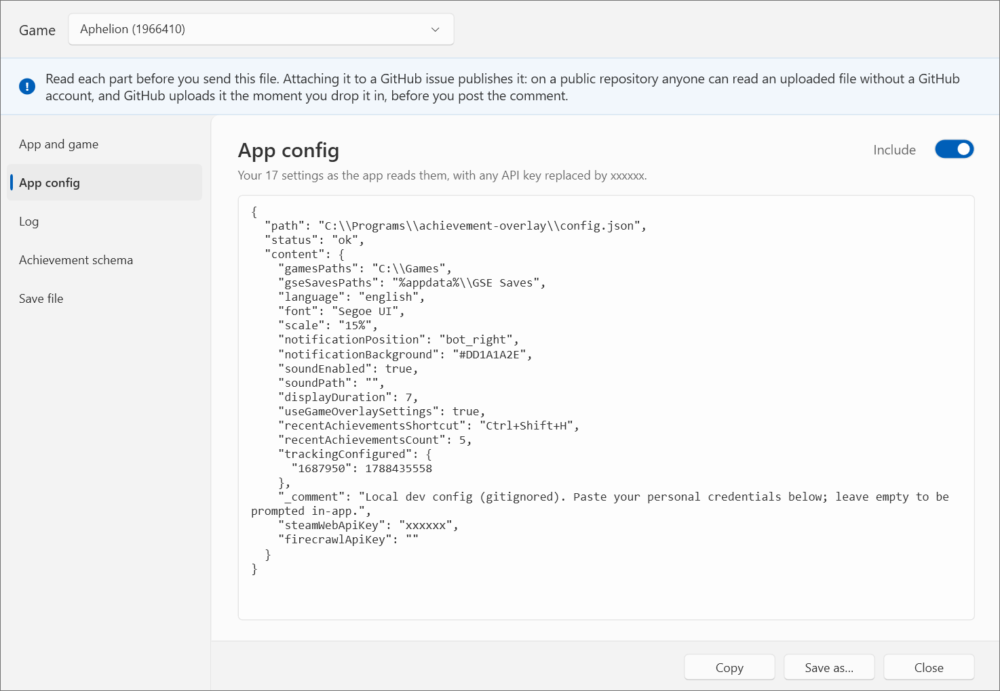

# Troubleshooting

The app writes a log file, `overlay.log`, next to the config file — the tray menu's **Open config/logs location** takes you there. Almost everything below is diagnosed from it, so start by looking for `[WARN]` and `[ERROR]` lines. Each run appends to the file and begins with a `===== session started` banner, so the run you are investigating is still there after a restart. Once the file passes 1 MB it is renamed to `overlay.log.1` and a fresh one begins.

To send a diagnosis rather than read one, use [Report a problem](#reporting-a-problem).

## The app will not start

The app shows an error dialog on startup if the config is missing, has invalid JSON, or has invalid settings. Click **Details** to see the full log. Common causes:

- **Config file not found** — make sure `config.json` is in the same folder as the executable. Re-extract it from the release archive if needed.
- **Invalid JSON** — fix the syntax in `config.json`, using the [example config](usage/configuration#example) as a reference.
- **Invalid settings** — required fields like `gseSavesPaths`, `gamesPaths`, `displayDuration` or `recentAchievementsCount` may be missing or hold invalid values.
- **GSE Saves directory does not exist** — check that `gseSavesPaths` points to valid directories (default `%appdata%\GSE Saves`). Non-existent paths are logged as warnings and skipped; the app exits only if none are valid.
- **No games with achievement metadata found** — a `[WARN]`, not fatal, since a game may still be tracked via [Other emulators](usage/other-emulators). Check that `gamesPaths` points to directories containing games with `steam_appid.txt` and `steam_settings/achievements.json`, and generate metadata with [Add game…](usage/adding-a-game) if needed.

## A game is not found

`[WARN] Game path does not exist` means `gamesPaths` names a directory that is not there.

If the game does not appear in the log at all, make sure its directory sits under one of the paths in `gamesPaths` and that it has a `steam_appid.txt` — either in the game root or inside `steam_settings/`. A hidden `steam_settings` folder is fine; those are scanned too.

`[WARN] Skipped: appid=... (no 'achievements.json')` means the game is detected but has no achievement metadata. Generate it with [Add game…](usage/adding-a-game).

`[WARN] No games with achievement metadata found` means none were found anywhere. The app keeps running, but only games tracked via [Other emulators](usage/other-emulators) will produce notifications.

## An achievement unlocked but nothing appeared

Check that `%appdata%\GSE Saves\<app_id>\achievements.json` exists and lists the unlock. If it does not, the emulator never recorded it and the overlay had nothing to show:

- Older emulator builds and some cracks write to `%appdata%\Goldberg SteamEmu Saves\` instead. Add that folder to `gseSavesPaths`.
- A folder named `4294967295` means the emulator never got a valid AppID — check `steam_appid.txt`.
- Achievements earned **before** you configured the game are never backfilled. The emulator only records an unlock at the moment the game reports it.

More detail in the [GBE reference](development/gbe-reference#where-unlocks-are-stored).

## The notification shows the default icon

The icon path in the game's `steam_settings/achievements.json` does not match an actual file. Check that the `icon` field (e.g. `"img/abc123.jpg"`) points to an existing file relative to the `steam_settings/` directory. The [schema format](development/gbe-reference#the-achievement-schema-format) lists the layouts different generators produce.

For a game tracked through a non-GBE emulator, the default icon also means no schema was found for it — see [Getting icons and the game name back](usage/other-emulators#getting-icons-and-the-game-name-back).

A third cause is that the emulator and the schema spell the same achievement differently, so the schema entry is never found. Compare a name in `%appdata%\GSE Saves\<app_id>\achievements.json` with the `name` fields in the game's `steam_settings/achievements.json`. Differences in capitalisation and in leading zeros are bridged automatically; anything else — a prefix the emulator adds or drops, a different separator — is not, and there is nothing to configure for it. If the log says an achievement `matches both '...' and '...' in the schema once leading zeros are ignored`, the schema lists that number under two spellings and the overlay declines to guess between them; delete the one that does not belong.

## Wrong language

The log shows `[WARN] Language '...' not available, falling back to english`. Pick a different **Achievement text** language in [Settings](usage/settings) — the list offers the ones your installed games actually carry, though a single game can still be missing any of them.

## The hotkey does nothing

If you pick a shortcut another application already owns, the [Settings](usage/settings) window says so when you save; the log also shows `[WARN] Could not register hotkey`. Pick a different combination under **Shortcut**. The tray menu item still works as a fallback.

## Notifications are too small

Raise **Popup size** in [Settings](usage/settings) — it scales the text along with everything else. The default is 15% of the screen width, which on a 1080p display works out to the smallest size the popup will draw; anything above that gives you bigger text.

## No sound

Check that **Play a sound on unlock** is on in [Settings](usage/settings). With **Custom file** selected, `[WARN] Sound file not found` means it has since been moved or deleted, and `[WARN] Could not play sound` means it is not a valid PCM `.wav`. In both cases no sound plays — switch to **Built-in sound**.

If one game sounds different from the rest, it is supplying its own — see [Per-game settings](usage/per-game-settings).

## Settings are not saving

If a change made in the [Settings](usage/settings) window does not persist, the log shows `[WARN] Config file is malformed, could not update` or `[WARN] Could not write config`. Fix the JSON syntax in `config.json`, or check file permissions on it.

## Reporting a problem

The tray menu's **Report a problem…** gathers what a diagnosis usually needs for one game into a single file. Pick the game, read the report, then **Save as…** and attach the `.json` to an issue.

Read it before you send it. Attaching it to an issue publishes it: on a public repository an uploaded file can be read by anyone without a GitHub account, and GitHub uploads it the moment you drop it into the comment box, before you post the comment.

The report is split into parts listed down the side, so you can read one without scrolling past the rest. Each part has an **Include this part** switch; turning one off marks it **left out** in the list and the file records that you left it out, so it stays clear the part was withheld rather than missing. Every part shows exactly what the saved file will contain.

The app sends nothing anywhere. It writes a file and you decide what happens to it. The parts are:

- The app version, including the exact build it was made from.
- Your `config.json`, with any API key replaced by `xxxxxx`. Folder paths are included, because which folder a game was found in is often the answer, but they are written in the portable form (`%appdata%\GSE Saves`) so your Windows account name does not travel with them.
- The log for the last five runs of the app, narrowed to the game you picked. Lines about your other games are removed and counted, so reporting one game does not publish your library. A run that logged exactly what the run before it logged is listed by its start time alone, since restarts usually repeat the same startup lines. The file itself keeps more runs; five covers hitting a problem, restarting, and trying again.
- Every `steam_settings` folder found for that game, deepest first. The first is where achievement text and icons come from, and a game having more than one is worth knowing.
- That game's `steam_settings/achievements.json` and its GSE Saves unlock file, or a note saying which was missing or unreadable.

If a game is missing from the list, the app cannot see it at all. That is itself the diagnosis, and the sections above cover it.

## Still stuck?

[Create a GitHub issue](https://github.com/AnotherSava/achievement-overlay/issues/new) describing the problem, and attach a report from **Report a problem…** (or just your log file). Misleading documentation is worth reporting too.

This is a hobby project, built to work around Red Dead Redemption's incompatibility with gbe_fork's built-in overlay. It may not work in every situation, but if it helps you as much as it helped me, it was definitely worth the effort.
