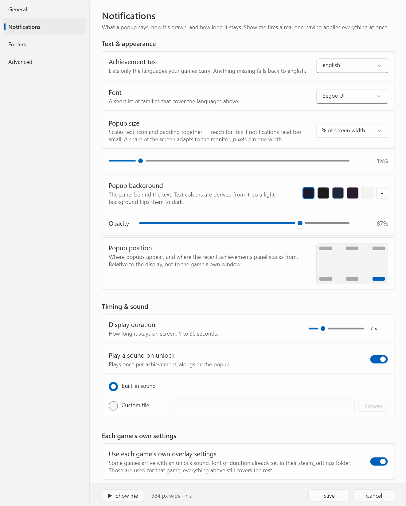

# Settings

**Settings…** in the tray menu opens a window covering every value in [`config.json`](configuration), plus the Windows startup entry (which lives in the registry rather than the config). It follows your Windows light/dark setting and accent colour.

Clicking **Save** writes only the settings that changed and applies them straight away: a new shortcut is re-registered, new **Game folders** trigger a rescan, and new **GSE Saves folders** restart the watcher. Nothing in here needs a restart.

## The four pages

- **General** — start with Windows, and the shortcut and count for the recent achievements panel.
- **Notifications** — everything about the popup: language, font, size, background colour, position, duration, sound, and whether a game's own settings may override them. **Show me** fires a real notification with the settings as they stand, and the footer states the popup's computed width and duration.
- **Folders** — game folders and GSE Saves folders, one card each, with a live status line saying what is actually there (how many games were found, or that a drive is not connected).
- **Advanced** — the Steam Web API and Firecrawl keys.

## Fields worth a note

**Achievement text** picks the language achievement names and descriptions appear in. The list holds the languages your installed games actually provide; a game that does not have the chosen one falls back to english.

**Shortcut** is captured rather than typed — click it and press the combination you want. Backspace clears it, leaving **Show recent achievements** in the tray menu as the way in. While the field has focus, the combination you press is recorded instead of running whatever normally owns it, so you can reassign a shortcut that is already taken — by this app, by another program, or by a desktop shortcut's **Shortcut key**. Nothing is intercepted once you click away from the field.

**Popup size** scales the whole popup — text, icon, padding and wrap width grow together — so this is the setting to reach for if notifications read too small. It never draws smaller than the popup's design size, so the text stays legible whatever unit you pick. Pick the unit: **% of screen width** keeps the popup the same apparent size on any monitor (the default 15% is what the overlay has always used), while **Pixels** pins it to one width everywhere. The footer states the width it actually works out to.

**Popup position** is a grid standing for your display: pick any of the six corners and edges GBE itself names, and the recent achievements panel stacks from the same place. Positions are relative to the *display* the game is on, not to the game's own window — that has always been true of the bottom-right default, and it is most noticeable if you play windowed and pick a centre position.

**Popup background** sets the panel behind the text, with **Opacity** beside it. The text colours are worked out from whatever you pick rather than left fixed, so a light background flips the text to dark and the secondary lines are lifted until they stay legible; the first swatch restores the shipped colour. Backgrounds close to mid-grey are the hard case — nothing gets far past 4.6:1 contrast there — so the smaller lines read lower whatever the app does.

**Game folders** and **GSE Saves folders** are edited a folder at a time with **Add folder**, **Change** and **Remove**. A folder you pick is stored with an environment variable where one fits — choosing your AppData GSE Saves folder is saved as `%appdata%\GSE Saves`, not as your user profile's full path — so the config stays portable between machines even after editing it here.

**Use each game's own overlay settings** lets a game that arrived with a `steam_settings/` folder of its own supply its unlock sound, its display duration and its font, for that game only. See [Per-game settings](per-game-settings).

**Metadata providers** holds the two keys the [Add game](adding-a-game) wizard asks for and reuses: the Steam Web API key that fetches achievement schemas and icons, and the optional Firecrawl key that fills in hidden-achievement descriptions.

## What is not here

**Pause notifications** is a momentary toggle rather than a setting, so it stays in the [tray menu](tray-menu) and a restart clears it.

Two entries are refused because they would fail silently: a **GSE Saves folders** list where none of the folders exist (the app will not start without one), and a **Custom file** sound that is not there. Everything else is saved as entered.
